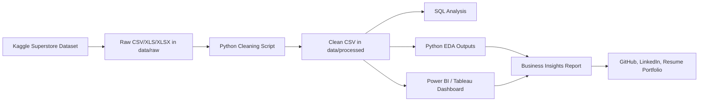

# Project Architecture And Workflow

## Architecture

## Workflow

1. Download the dataset from Kaggle.
2. Store the file in `data/raw/`.
3. Run `scripts/clean_superstore.py`.
4. Validate cleaned column names, date fields, numeric fields, nulls, and duplicates.
5. Run `scripts/eda_superstore.py`.
6. Run SQL queries from `sql/superstore_analysis.sql`.
7. Build the BI dashboard using the dashboard blueprint.
8. Capture dashboard screenshots.
9. Finalize the business insights report.

## Data Cleaning Checklist

- Removed duplicate rows.
- Standardized column names.
- Converted order and ship dates to date fields.
- Converted sales, quantity, discount, profit, and shipping cost to numeric fields.
- Filled missing numeric values with safe defaults.
- Filled missing text values with `Unknown`.
- Created order month, year, year-month, shipping days, profit margin, discount band, and profitability flag.

